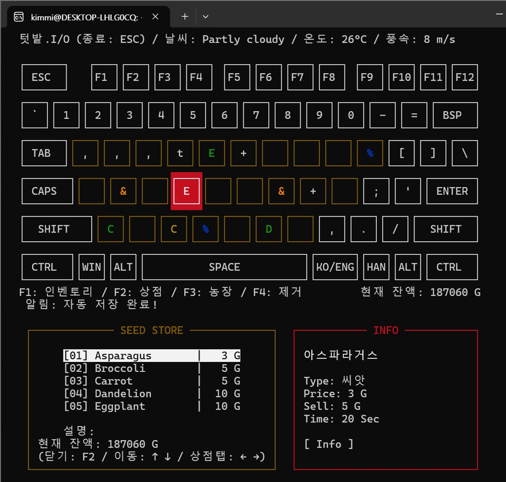

# 🌻 텃밭.I/O

## 📖 프로젝트 소개
**'텃밭.I/O'** 은 C언어와 `ncursesw` 라이브러리를 활용하여 터미널 환경에서 즐길 수 있는 타이핑 농장 경영 게임입니다. (시스템프로그래밍 팀 프로젝트)
실제 키보드 배열과 똑같이 매칭된 텃밭에 씨앗을 심고, 농기구를 배치하며, 쉴 새 없이 덮쳐오는 병충해를 물리쳐 나만의 풍성한 농장을 만들어보세요!

* **메인 화면 및 밭 UI**
  <br/>

## ✨ 주요 기능

* **⌨️ 직관적인 키보드 매핑 시스템**
  * 화면의 밭(Q, W, E...)이 실제 키보드 자판의 물리적 위치와 1:1로 대응되어 몰입감 넘치는 조작감을 제공합니다.
* **🌱 실시간 작물 성장 시스템**
  * 시간에 따라 작물이 성장하며, 확률에 따라 희귀한 '황금 작물'을 수확할 수 있습니다.
* **🛠️ 전략적인 농장 장비 배치 (인접 좌표 계산 로직)**
  * **스프링클러(`%`):** 설치 시 주변 8방향(대각선 포함) 밭의 작물 성장 속도를 2배로 증가시킵니다.
  * **허수아비(`&`):** 설치 시 주변 8방향 밭에 병충해가 발생하는 것을 완벽하게 차단합니다.
* **🐛 긴장감 넘치는 병충해 미니게임**
  * 작물에 벌레(빨간색 표시)가 생기면 해당 밭의 알파벳을 5번 연타하여 퇴치해야 합니다.
  * **데스 타이머:** 15초 안에 벌레를 잡지 않고 방치하면 작물이 시들어 죽어버립니다.
* **🔨 퀵 철거 모드 (F4)**
  * 복잡한 메뉴 이동 없이 단축키 `F4`를 통해 잘못 심은 작물이나 장비를 즉시 철거(초기화)할 수 있습니다. 유저 실수를 방지하기 위한 2단계 더블 체크 로직이 적용되어 있습니다.
* **🌦️ 동적 날씨 변화 시스템**
  * 일정 시간마다 터미널 환경에 실시간으로 날씨(맑음, 비, 폭염 등)가 변화하며 작물 성장에 직접적인 영향을 미칩니다.
  * **비:** 비가 내리는 동안에는 모든 밭에 자동으로 물이 공급되어 작물의 성장 속도가 기본보다 빠르게 증가합니다.
  * **더운 날씨:** 병충해가 생성되지 않습니다!

## 🎮 조작 방법 (Controls)

* **알파벳 키 (A~Z 등):** 해당 위치의 밭 선택 / 작물 심기 / 병충해 퇴치 (5회 연타)
* **F1 / F2 / F3:** 상점, 인벤토리 등 시스템 메뉴 이동
* **F4:** 철거(회수) 모드 ON / OFF
* **ESC:** 현재 행동 취소 및 메인 화면으로 돌아가기

## 💻 개발 환경 및 빌드 방법

* **Language:** C
* **Libraries:** `ncursesw` (유니코드/와이드 문자 지원), `math`

**터미널(Terminal) 명령어:**

* **빌드 (컴파일):**
  ```bash
  make

* **게임 실행:**
 ```bash
 ./farm_game
 ```

* **빌드 파일 삭제 (목적 파일 및 실행 파일 제거):**
 ```bash
 make clean
 ```

* **세이브 데이터 초기화 (save.dat 파일 삭제):**
 ```bash
 make reset
 ```

## 👥 팀(REGO) 팀원 정보 및 역할

* **김민환**
  * 프로그래밍 : 시스템 아키텍처 설계, 슈도코드를 기반으로 한 핵심 로직 개발
  * UI/UX 디자인 : 직관적인 조작 설계, 터미널 시각화
  * QA : 게임 플레이를 통한 버그 발견 및 디버깅
  
* **류도훈**
  * 기획 : 게임 아이디어 제시 및 핵심 루프 기획, 키보드 활용의 이점 및 소켓 활용 날씨 정보 반영 기획
  * 시스템 및 밸런스 디자인  : 게임 내 경제 시스템 설계 및 아이템 능력 설계, 랜덤 요소 등장 확률 설계,  QA 바탕 밸런스 디자인
  * 슈도코드 : 필요한 시스템 슈도코드 작성 및 슈도코드의 핵심 구현 내용 기재